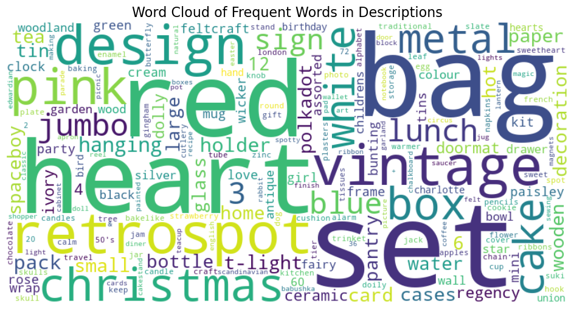
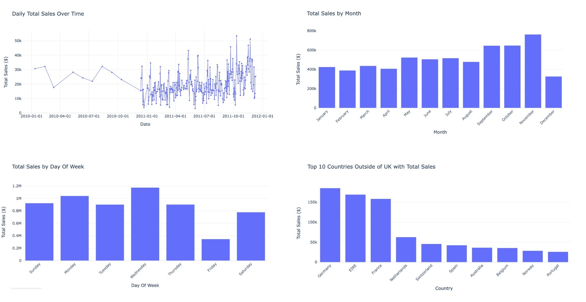

# Demand Forecasting Model for Retail Using PySpark and Random Forest Regressor

In this project, I developed a demand forecasting model for a retail dataset to provide insights and forecast product quantity requirements, aiding in inventory management. The analysis and model building were conducted in PySpark, with data visualizations created in Plotly.

### Dataset Overview:
- **Total Entries:** 384,721
- **Total Customers:** 4,261
- **Total Invoices:** 17,635
- **Total Stock Items:** 3,649
- **Countries Represented:** 37

### Key Insights

- **Word Cloud Analysis**: Created a word cloud to showcase the most frequent terms in product descriptions, highlighting popular customer interests. 

  > *Interactive visualizations available in the notebook.*
- **Exploratory Data Analysis**:
  - **Sales Trends**: Analyzed daily, monthly, and weekly sales trends, revealing that customer orders peak from September to November, with reduced activity on weekends and a mid-week peak on Wednesdays.
  - **Geographic Insights**: While the majority of sales occur within the UK, other notable regions include Germany, Ireland, and France.

### Machine Learning Model
To build the forecasting model, I aggregated the dataset by `Country`, `StockCode`, `InvoiceDate`, `Year`, `Month`, `Day`, `Week`, and `DayOfWeek`, summing up `Quantity` and averaging `UnitPrice`. Data before **September 25, 2011**, was used for training, while the remainder served as test data.

The model pipeline incorporated data preprocessing and a **Random Forest Regressor** for prediction. The model achieved a **Mean Absolute Error (MAE)** of 9.815. Below are the weekly predictions for quantity sold:

| Year | Week | Predicted Quantity Sold |
|------|------|--------------------------|
| 2011 | 39   | 91,611                   |
| 2011 | 40   | 50,757                   |
| 2011 | 41   | 86,658                   |
| 2011 | 42   | 100,959                  |
| 2011 | 43   | 100,968                  |
| 2011 | 44   | 59,909                   |
| 2011 | 45   | 97,740                   |
| 2011 | 46   | 117,676                  |
| 2011 | 47   | 110,280                  |
| 2011 | 48   | 74,396                   |
| 2011 | 49   | 65,924                   |
